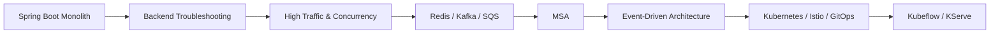

# 🎫 TelePort

> **예매부터 결제까지, 빠르고 안정적으로 목적지에 도착하는 티켓팅 플랫폼**

TelePort는 공연·전시·이벤트를 탐색하고 좌석을 예매한 뒤 결제까지 진행할 수 있는 **고트래픽 티켓팅 서비스이자 백엔드·분산 시스템·MLOps 학습 프로젝트**입니다.

이름 **TelePort**에는 세 가지 의미를 담았습니다.

- ⚡ **빠르게** — 예매 시작부터 결제 완료까지 빠르게 도달한다.
- 🚀 **안정적으로** — 많은 사용자가 동시에 몰려도 예매 흐름이 무너지지 않는다.
- 🎭 **설레게** — 기다리는 공연과 전시의 순간이 텔레포트하듯 빨리 다가오기를 기대한다.

> 이 프로젝트는 실제 금융 거래를 처리하지 않습니다. 결제·환불·지갑·정산은 **Mock Payment Gateway와 가상 금액**을 사용합니다.

---

## 프로젝트 목표

TelePort의 핵심 질문은 하나입니다.

> **10명이 사용하던 Spring Boot 애플리케이션을 10,000명이 동시에 사용하면 어떤 일이 일어나는가?**

단순히 기능을 완성하는 것이 아니라, 실제 백엔드가 겪을 수 있는 장애와 병목을 **의도적으로 발생시키고 관측·분석·해결하는 것**이 프로젝트의 핵심입니다.

- Spring Boot 기반 **Monolith**로 시작
- JPA, MySQL, Transaction, Lock, Connection Pool 등 백엔드 기본기 학습
- 대규모 동시 요청에서 Race Condition, Double Booking, Duplicate Payment 등 재현
- Redis / Kafka / SQS를 활용한 캐시·비동기 처리·이벤트 기반 구조 학습
- Monolith의 한계를 확인한 뒤 **MSA로 전환**
- Saga, Outbox, Inbox, Idempotency, Retry, DLQ 등 분산 시스템 패턴 구현
- Kubernetes / Istio / Observability / GitOps를 이용한 운영 환경 구성
- 실제 서비스에서 생성된 데이터를 활용해 ML 모델을 학습하고 **Kubeflow + KServe 기반 MLOps** 적용

---

## 아키텍처 진화



MSA를 처음부터 적용하지 않습니다. **Monolith에서 실제 문제를 충분히 경험한 뒤, 왜 서비스 분리가 필요한지를 확인하고 전환**하는 것을 원칙으로 합니다.

---

## 주요 기술 스택

| 영역 | 기술 |
| --- | --- |
| Backend | Spring Boot, Spring Cloud |
| Frontend | Vite, React |
| Database | AWS RDS MySQL |
| Cache | Redis |
| Messaging | Kafka, AWS SQS |
| Cloud | AWS VPC, EC2, RDS |
| Kubernetes | Self-managed Kubernetes on EC2 (**No EKS**) |
| Service Mesh | Istio |
| GitOps | ArgoCD |
| CI | GitHub Actions |
| Observability | Prometheus, Grafana, Loki, Tempo, OpenTelemetry |
| MLOps | Kubeflow, KServe |
| Optional | ELK, Terraform, Ansible |

---

## 핵심 서비스 기능

사용자는 TelePort에서 다음 흐름을 경험합니다.

```text
공연/전시 탐색
      ↓
회차 및 좌석 조회
      ↓
좌석 선점 / 예매
      ↓
Mock 결제
      ↓
티켓 발급
      ↓
취소 / 환불
```

초기 금융 도메인은 다음 범위로 제한합니다.

- Payment
- Refund
- Wallet
- Ledger
- Settlement

`Resale`, `Escrow` 등은 핵심 학습 범위를 완료한 이후의 확장 기능으로 둡니다.

---

## Experiment-driven Development

TelePort는 전체 장애·성능 시나리오를 **Experiment 카탈로그**로 관리합니다.

전체 Experiment를 기록하고, 그중 **40개를 실제 구현 대상**으로 선정하여 다음 절차를 반복합니다.

```text
가설 수립
  ↓
문제 재현
  ↓
Metric / Log / Trace 관측
  ↓
Root Cause 분석
  ↓
Application / Platform 관점 해결
  ↓
부하 테스트
  ↓
Before / After 비교
```

주요 실험 영역은 다음과 같습니다.

- JPA N+1 / Query 최적화 / Index 설계
- Transaction Boundary / Isolation Level / Deadlock
- 좌석 중복 예약 / Lost Update / Wallet 동시 출금
- HikariCP Connection Pool 고갈
- Cache Stampede / Hot Key / Cache Penetration
- Timeout / Retry Storm / Cascading Failure / Circuit Breaker
- Kafka Duplicate Event / Ordering / Consumer Lag / Poison Message
- Saga / Transactional Outbox / Inbox / Compensation
- Kubernetes OOMKilled / Probe / HPA / Graceful Shutdown
- Prometheus / Loki / Tempo를 이용한 장애 원인 분석
- Payment / Refund / Ledger / Settlement 정합성 문제

중요한 원칙은 **문제를 단순히 인프라 확장으로 덮지 않는 것**입니다.

각 Experiment마다 다음을 명확히 기록합니다.

- Root Cause Layer
- Primary Fix
- Application Mitigation
- Platform Mitigation
- Before / After 결과

---

## MLOps 확장

백엔드와 분산 시스템 학습이 완료된 뒤 TelePort에서 생성되는 데이터를 활용합니다.

초기에는 LLM보다 일반 ML 모델부터 시작합니다.

- 티켓 오픈 시점 수요 / Peak RPS 예측
- 이상 결제 탐지(Fraud Detection)
- XGBoost / LightGBM / scikit-learn 기반 모델 학습
- Kubeflow Pipeline 기반 전처리 → 학습 → 평가 자동화
- KServe 기반 모델 서빙
- 추후 필요 시 LLM / LLMOps 영역 확장

---

## Repository Guide

```text
/
├─ README.md
├─ AGENTS.md
├─ CONTEXT.md
├─ backend/            # Spring Boot 애플리케이션
├─ frontend/           # Vite + React
├─ experiments/        # 장애 재현 및 분석 보고서
├─ infra/              # k8s / ArgoCD / Istio / observability / AWS 관련 정의
├─ ml/                 # Kubeflow pipeline, training, KServe 관련 코드
└─ docs/               # 아키텍처 / ADR / 관측성 / Experiment 결과 / MLOps 결과
```

세부 프로젝트 결정사항과 전체 Experiment 목록은 [`CONTEXT.md`](./CONTEXT.md), AI 작업 규칙은 [`AGENTS.md`](./AGENTS.md)를 기준으로 합니다.

---

## Project Status

현재 단계: **설계 및 학습 로드맵 수립**

구현이 진행되면 서비스 화면과 핵심 기술 결과를 문서화합니다. 상세 기술 산출물은 [`/docs`](./docs)에 축적하고, README에서는 대표 결과와 링크만 노출할 예정입니다.

`/docs`에는 다음 결과물을 정리합니다.

1. **Grafana Dashboard** — 트래픽, JVM, HikariCP, MySQL, Redis, Kafka, Kubernetes 주요 지표
2. **Tempo Distributed Trace** — 실제 장애 시나리오의 요청 흐름과 병목 구간
3. **주요 Experiment Before / After 결과** — 장애 재현, Root Cause, Backend Fix, Platform Mitigation, 개선 수치
4. **Monolith → MSA 전환 과정** — 분리 배경, 서비스 경계, 트레이드오프, Saga / Outbox 등 적용 과정
5. **Kubeflow / KServe MLOps Pipeline** — 데이터 처리, 학습, 평가, 모델 서빙 및 운영 흐름

서비스 UI 화면과 전체/단계별 아키텍처 다이어그램 역시 구현 진행에 따라 README 또는 `/docs`에서 확인할 수 있도록 정리합니다.
